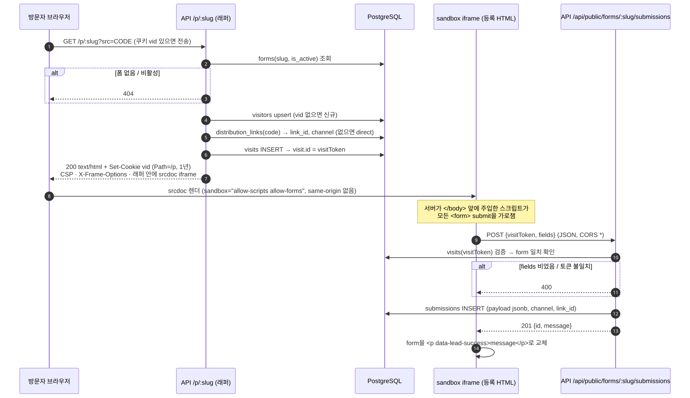

# 리드마그넷 CRM 운영 시스템

운영자가 AI로 만든 HTML 신청 폼을 등록해 캠페인·채널별 배포 링크를 만들고, 방문자가 격리된 공개 폼에서 신청하며, 운영자가 채널별 성과(조회수·방문자 수·신청·전환율)를 확인하는 시스템입니다. NestJS + Next.js 모노레포, `docker compose` 한 번으로 실행·테스트합니다.

## 제출물 한눈에 보기

| 항목 | 위치 |
|---|---|
| 실행 가능한 소스 코드 | 이 저장소 — `apps/api`(NestJS 11 + TypeORM 0.3 + PostgreSQL 16), `apps/web`(Next.js 16 + React 19) |
| DB 스키마·마이그레이션 | `apps/api/src/entities/`, `apps/api/src/migrations/` (아래 [스키마·마이그레이션](#데이터베이스-스키마마이그레이션)) |
| `.env.example` | [`.env.example`](.env.example) — 실행에 필요한 모든 환경 변수 |
| 테스트 코드 | 단위 `apps/api/src/**/*.spec.ts`·`apps/web/**/*.test.tsx`, e2e `apps/api/test/*.e2e-spec.ts`, 브라우저 `e2e/*.spec.ts`, API 계약 `bruno/` |
| API 문서 | Scalar UI `http://localhost:3001/api/docs`, OpenAPI `docs/openapi.json`, 실행형 `bruno/leadmagnet-crm/` |
| README | 이 문서 |
| ADR | [`docs/adr/`](docs/adr/) (0001–0021, [목록](docs/adr/README.md)) |
| 다이어그램 | [`docs/diagrams.md`](docs/diagrams.md) (원본 Mermaid), 아래 이미지 |
| AI 생성 가이드·샘플 | [`docs/ai-generation-guide.md`](docs/ai-generation-guide.md), [`samples/`](samples/) |

## 빠른 시작

```bash
cp .env.example .env
docker compose up --build
```

| 대상 | 주소 |
|---|---|
| 관리자 화면 | http://localhost:3000 (계정: `.env`의 `ADMIN_EMAIL` / `ADMIN_PASSWORD`) |
| API 문서(Scalar) | http://localhost:3001/api/docs |
| OpenAPI JSON | http://localhost:3001/api/docs-json (파일: `docs/openapi.json`) |

`.env.example`의 기본 계정·비밀번호는 로컬 전용입니다. 호스트의 5432 / 5433 / 3000 / 3001 포트가 비어 있어야 합니다.

## 테스트

```bash
# 단위 + e2e + 커버리지 게이트(90%)를 테스트 전용 DB에서 (권장)
docker compose --profile test run --rm --build api-test

# 실행 스택 위에서 브라우저 테스트(격리 공격 시나리오 + 데스크톱 레이아웃 실측)
docker compose up -d --wait
pnpm exec playwright install chromium && pnpm test:e2e:browser

# API 계약 컬렉션(Bruno) — 실행 스택 필요
pnpm bruno:run
```

로컬에서 개별 실행:

```bash
pnpm install
docker compose up -d db-test
set -a && . ./.env && set +a
pnpm --filter api test:cov   # API 단위+e2e 합산 커버리지(90/80/90/80 게이트)
pnpm --filter web test:cov   # 관리자 화면 커버리지
```

`.github/workflows/ci.yml`이 push·PR마다 세 잡을 병렬 실행합니다: `api`(단위+e2e+커버리지), `web`(테스트+빌드), `integration`(compose 스택 + Bruno + 스모크 + 브라우저 테스트).

## 데이터베이스 스키마·마이그레이션

`synchronize: false`. 스키마는 `apps/api/src/migrations/*.ts`로만 바꿉니다. 엔티티는 `apps/api/src/entities/`.

| 마이그레이션 | 내용 |
|---|---|
| `1757400000000-init` | 9개 테이블·2개 enum·인덱스·제약 초기 생성 |
| `1788963052048-submission-visit-unique` | 방문당 신청 1건(`submissions.visit_id` UNIQUE) |
| `1788978200000-template-deleted-at` | 템플릿 소프트 삭제(`deleted_at`) |
| `1788980000000-operator-role-active` | 운영자 역할·활성 컬럼 |
| `1788990000000-template-name-unique` | 살아 있는 템플릿 이름 고유(부분 유니크) |

### ERD



`operators` 1:N `sessions` · `html_templates`/`campaigns` 1:N `forms` · `forms` 1:N `distribution_links`(채널당 1개)·`visits`·`submissions` · `visitors` 1:N `visits`·`submissions`. 신청 payload는 스키마 없는 `jsonb`로 원본 저장합니다.

## 흐름

**운영자** — 로그인 → HTML 등록 → 캠페인·폼 생성 → 채널별 배포 링크 → 성과·명단 조회



**방문자** — 배포 링크 방문 → 격리 iframe 렌더 → 제출 → CRM 저장



**격리 3겹** — 등록 HTML이 관리자 인증 정보·관리자 API에 접근하지 못하게 합니다.



**성과 집계**



**개발·검증 파이프라인**



## 아키텍처

- **apps/api** (NestJS 11): 관리자 API(`/api/admin/*`, 세션 쿠키), 공개 API(`/api/public/*`), 공개 폼 래퍼(`/p/:slug`). TypeORM 0.3 + PostgreSQL 16, `@nestjs/swagger` + Scalar.
- **apps/web** (Next.js 16 App Router + React 19 + Tailwind + shadcn/ui): 관리자 화면. `rewrite`로 관리자 API를 호출합니다.
- **격리**: 등록 HTML은 `sandbox`(allow-same-origin 없음) iframe + CSP로만 렌더합니다. 관리자 세션 쿠키는 `Path=/api/admin`, 관리자 API는 CORS를 열지 않습니다. 자세한 검증은 ADR 0018·`e2e/isolation.spec.ts`.

설계 결정과 근거는 [`docs/adr/`](docs/adr/)에 21건으로 기록돼 있습니다(스택 선택, 폼 제출 계약, 격리, 인증, 전환율, 데이터 모델, 테스트·도커, API 문서, CI, TDD·커버리지, AI 생성 경계, 템플릿 생애주기, PostgreSQL 선택, 대시보드 갱신, 트랜잭션·N+1, 격리 검증, 캠페인 생애주기, 운영자 역할, 데스크톱 레이아웃).

## 로컬 개발

```bash
docker compose up -d db
set -a && . ./.env && set +a
pnpm --filter api migration:run:dev && pnpm --filter api seed:dev
pnpm dev:api   # 3001
pnpm dev:web   # 3000
```
