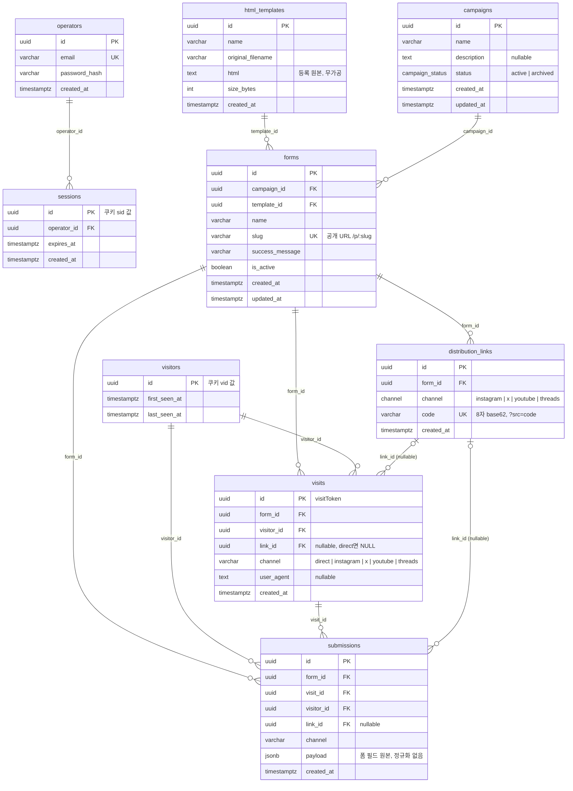
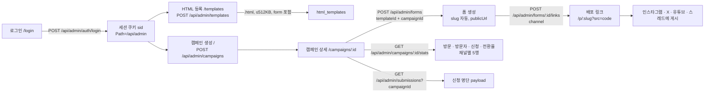
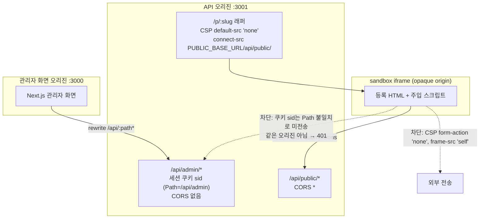
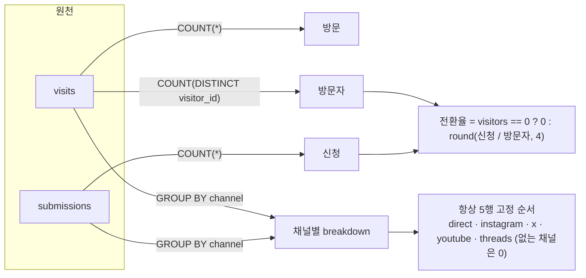
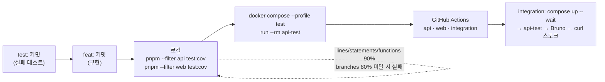

# 다이어그램 (Mermaid)

설계 스펙 `superpowers/specs/2026-09-09-leadmagnet-crm-design.md`와 ADR을 그림으로 옮긴 참고 문서다. 계약의 최종 권위는 스펙이며, 이 문서는 그 요약이다.

## 1. DB 스키마 (ER)

마이그레이션 `apps/api/src/migrations/1757400000000-init.ts` 기준. 컬럼명은 snake_case, PK는 모두 uuid.

제약: `distribution_links UNIQUE(form_id, channel)` (채널당 링크 1개), `forms.slug UNIQUE`, `operators.email UNIQUE`. 인덱스: `visits(form_id)`, `visits(link_id)`, `submissions(form_id)`, `submissions(created_at)`.

## 2. 운영자 흐름 (관리자 화면 → 관리자 API)

## 3. 방문자 흐름 (공개 페이지 → 공개 API)

```mermaid
sequenceDiagram
    autonumber
    participant V as 방문자 브라우저
    participant P as API /p/:slug (래퍼)
    participant DB as PostgreSQL
    participant I as sandbox iframe (등록 HTML)
    participant S as API /api/public/forms/:slug/submissions

    V->>P: GET /p/:slug?src=CODE (쿠키 vid 있으면 전송)
    P->>DB: forms(slug, is_active) 조회
    alt 폼 없음 / 비활성
        P-->>V: 404
    end
    P->>DB: visitors upsert (vid 없으면 신규)
    P->>DB: distribution_links(code) → link_id, channel (없으면 direct)
    P->>DB: visits INSERT → visit.id = visitToken
    P-->>V: 200 text/html + Set-Cookie vid (Path=/p, 1년)<br/>CSP · X-Frame-Options · 래퍼 안에 srcdoc iframe
    V->>I: srcdoc 렌더 (sandbox="allow-scripts allow-forms", same-origin 없음)
    Note over I: 서버가 </body> 앞에 주입한 스크립트가<br/>모든 <form> submit을 가로챔
    I->>S: POST {visitToken, fields} (JSON, CORS *)
    S->>DB: visits(visitToken) 검증 → form 일치 확인
    alt fields 비었음 / 토큰 불일치
        S-->>I: 400
    end
    S->>DB: submissions INSERT (payload jsonb, channel, link_id)
    S-->>I: 201 {id, message}
    I->>I: form을 <p data-lead-success>message</p>로 교체
```

## 4. 격리 3겹 (ADR 0003)

세 겹은 서로 독립적으로 동작한다. (1) 관리자 화면과 API의 오리진 분리, (2) 세션 쿠키의 `Path=/api/admin` 한정, (3) `allow-same-origin` 없는 sandbox iframe과 CSP. 하나가 뚫려도 등록 HTML이 관리자 자격 증명이나 관리자 API에 닿지 못한다.

## 5. 성과 집계 (ADR 0005 · 0006)

- 방문 = `GET /p/:slug` 1회 = visits 1행. 방문자 = 1년짜리 `vid` 쿠키 1개. 새로고침은 방문만 늘고 방문자는 그대로다.
- 채널 귀속은 마지막 클릭(`?src=code`) 기준이며, 폼에 속한 유효한 코드가 아니면 `direct`.
- 캠페인 집계는 `forms.campaign_id`로 JOIN한 뒤 위 식을 적용한다.

## 6. 개발·검증 파이프라인 (ADR 0008 · 0010 · 0011)

